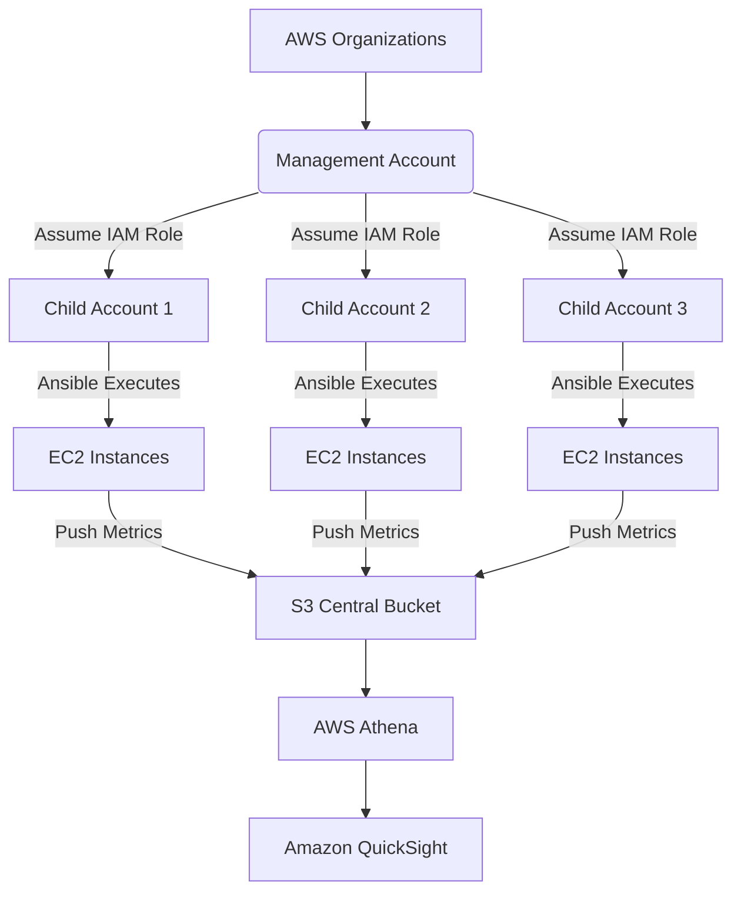
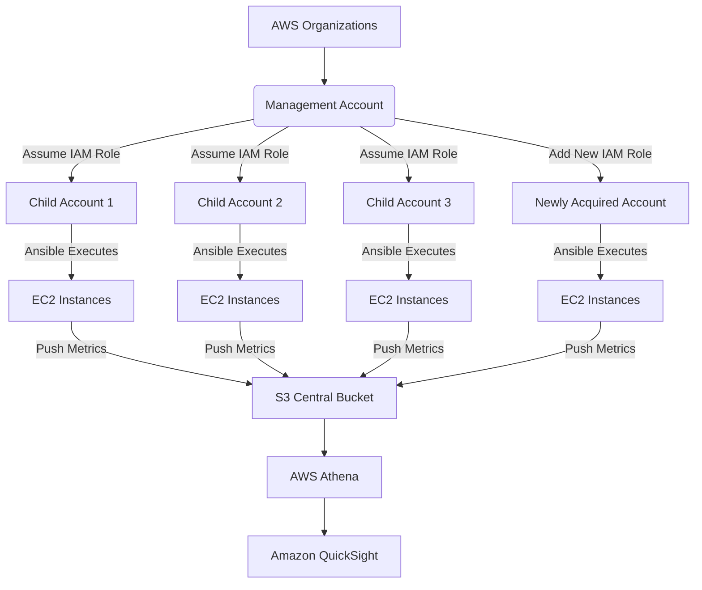
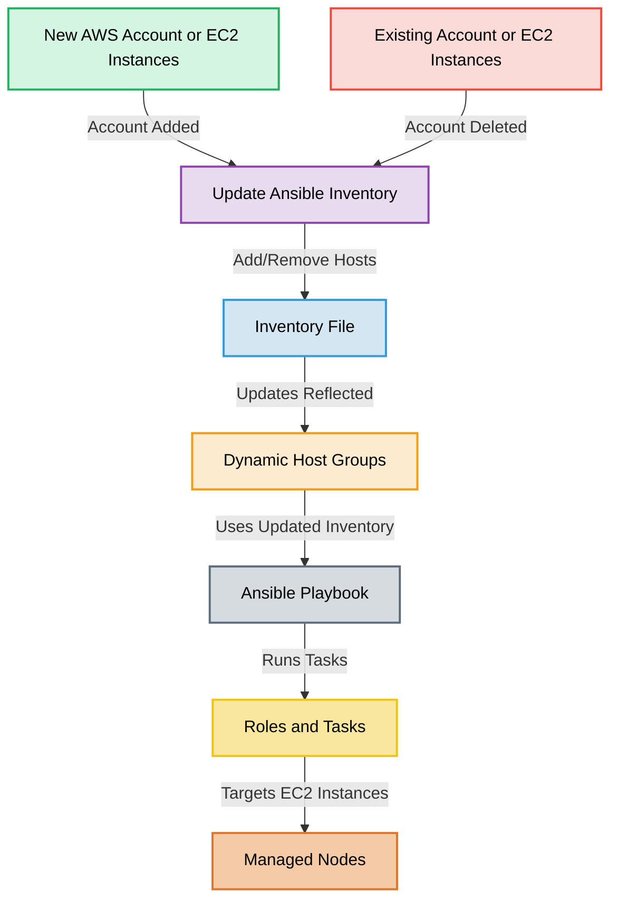
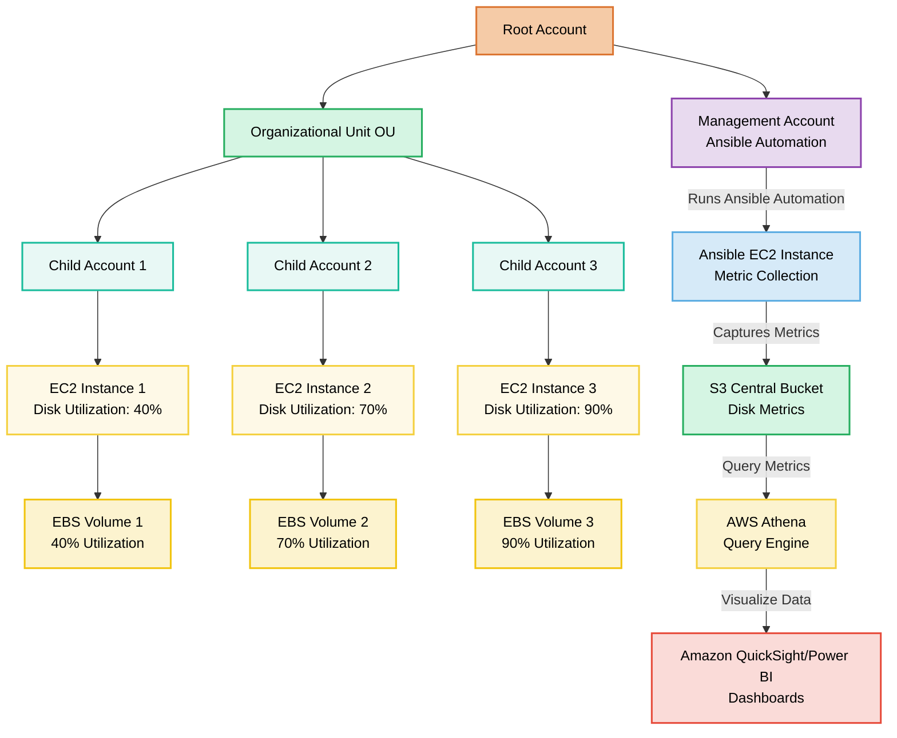

# ***Case study : Multi-Account AWS EC2 Disk Utilization Monitoring*** 

**Background:**
You are a Solutions architect at a large enterprise that utilizes AWS cloud services. The company has grown through acquisitions and now manages 3 separate AWS accounts, each containing numerous EC2 instances. The CTO has expressed concerns about potential disk space issues across these instances and wants a comprehensive solution to monitor disk utilization.

**Assignment:**

Company is internally using a configuration management tool (Ansible). Before investing into other tools, the company has decided to use Ansible to perform the required metric collection.

Design and outline a solution to fetch and report disk utilization from all EC2 instances across the 3 AWS accounts. Your solution should address the following points:

1\. How would you centralize access and management of the 3 AWS accounts?

2\. How would you aggregate the collected data from all accounts into a single, easily digestible format?

3\. How would your solution scale if the company acquires more companies and AWS accounts in the future?

						
**Deliverables :**

1\. Provide a high-level architectural diagram of your proposed solution. 

2\.  Provide the ansible playbook

3\.  Summarize the various component involved in the process 


### Centralized Access and Management of Multi-Account AWS EC2 Disk Utilization Monitoring

This document provides a comprehensive solution to centralize access and management of three AWS accounts, automate data collection using Ansible, and aggregate the data into a digestible format.

---

### **1. High-Level Architectural Diagram**

The architecture centralizes access and management using **AWS Organizations** and **IAM Roles**. It ensures secure and scalable data aggregation from multiple AWS accounts.

Part A: Considering only 3 EC2 instance each dstributed across different AWS account, following will be the flow of control.

#### **3\. Key Components of the Solution**

1. **Centralized Access and Management:**  
     
   - Set up **AWS Organizations** to link all accounts.  
   - Use a **Management Account** to assume roles in other accounts using IAM policies.  
   - Enable **AWS Config** and **CloudTrail** for auditing and governance.

   

2. **Data Aggregation:**  
     
   - EC2 instances send disk utilization metrics (collected via Ansible) to **S3** in the Management Account.  
   - Configure **S3 Lifecycle Policies** for cost-effective storage.  
   - Use **AWS Athena** to run queries and generate reports.

   

3. **Scaling for Future Accounts:**  
     
   - Automate the inclusion of new accounts by extending AWS Organizations and updating IAM roles.  
   - Design the Ansible playbook to dynamically retrieve account details and EC2 inventory using AWS CLI.


---
Part B: 








Part C:
1. **Centralized Data Aggregation:**  
     
   - Collected metrics from EC2 instances across multiple AWS accounts are stored in a central **AWS S3 bucket** in the Management Account.  
   - Data from S3 is queried using **AWS Athena** for on-demand analytics.

   

2. **Scalable Multi-Account Access:**  
     
   - **AWS Organizations** manages multiple accounts, and **IAM roles** enable cross-account access.  
   - **Ansible Playbook** is used to automate disk utilization data collection.

   

3. **Visualization and Reporting:**  
     
   - Aggregated data can be visualized using **Amazon QuickSight** or exported for further analysis.





Part D:




Part G:

```mermaid

```
#### **Additional Considerations**

1. **Security:**  
     
   - Ensure **IAM Role Policies** follow the least privilege principle.  
   - Avoid hardcoding credentials; use IAM roles and temporary credentials.

   

2. **Error Handling and Testing:**  
     
   - Test the Ansible playbook with a few EC2 instances before full deployment.  
   - Implement error handling and logging for all playbook steps.

   

3. **Documentation:**  
     
   - Include a README file in the GitHub repository with setup instructions and details about the playbook and architecture.


---

### **2. Ansible Playbook**

#### **Playbook Overview**
**Steps in the Playbook:**

1. **Install AWS CLI:** Ensures the managed nodes have the necessary tool to interact with AWS services.  
2. **Fetch Disk Utilization:** Runs the `df` command to capture disk metrics and stores the output in a temporary file.  
3. **Copy Locally:** Copies the metrics from the managed nodes to the control node for review.  
4. **Upload to S3:** Pushes the metrics to a centralized S3 bucket in the Management Account for aggregation.

#### **Playbook: `aws-disk-monitoring/disk_monitoring.yml`**

```yaml
---
- name: Multi-Account EC2 Disk Monitoring
  hosts: all
  gather_facts: false
  tasks:
    - name: Install AWS CLI
      yum:
        name: aws-cli
        state: present

    - name: Collect Disk Utilization
      shell: |
        df -h | grep '^/dev/' > /tmp/disk_usage.txt
      register: disk_utilization_output

    - name: Validate Disk Utilization File
      stat:
        path: /tmp/disk_usage.txt
      register: disk_file

    - name: Upload Metrics to Central S3
      aws_s3:
        bucket: central-metrics-bucket
        object: "metrics/{{ inventory_hostname }}_disk_usage.txt"
        src: /tmp/disk_usage.txt
        mode: put
        region: us-east-1
      when: disk_file.stat.exists
```

#### **How to Use the Playbook**
1. Define hosts in an inventory file (`inventory.yml`).
2. Run the playbook:
   ```bash
   ansible-playbook -i inventory.yml disk_monitoring.yml
   ```

---

### **3. Centralized Access and Management**

#### **Using AWS Organizations**
1. **Centralized Management with AWS Organizations:**
   - Link all AWS accounts to a single **Management Account**.
   - Enable consolidated billing and governance for all accounts.

2. **IAM Roles for Cross-Account Access:**
   - Create **IAM Roles** in each Child Account that the Management Account can assume.
   - Roles include permissions for EC2 instance access and S3 uploads.

3. **Example IAM Role Policy (Child Account):**
   ```json
   {
     "Version": "2012-10-17",
     "Statement": [
       {
         "Effect": "Allow",
         "Principal": {
           "AWS": "arn:aws:iam::MANAGEMENT_ACCOUNT_ID:root"
         },
         "Action": "sts:AssumeRole"
       },
       {
         "Effect": "Allow",
         "Action": [
           "ec2:DescribeInstances",
           "ec2:DescribeVolumes",
           "s3:PutObject",
           "s3:GetObject"
         ],
         "Resource": "*"
       }
     ]
   }
   ```

4. **Security Best Practices:**
   - Enforce MFA for role assumption.
   - Enable CloudTrail and AWS Config for monitoring access and compliance.

---

### **4. Aggregating Data into a Single Format**

#### **Centralized Data Aggregation**
1. Collected metrics are uploaded to a centralized **S3 Bucket** in the Management Account.
   - Data is organized using prefixes:
     ```
     /child-account-id/instance-id/disk_usage.txt
     ```

2. Use **AWS Athena** to query data from S3:
   - Example Athena table:
     ```sql
     CREATE EXTERNAL TABLE disk_utilization (
       account_id STRING,
       instance_id STRING,
       disk_partition STRING,
       total_space STRING,
       used_space STRING,
       available_space STRING,
       utilization_percentage STRING
     )
     LOCATION 's3://central-metrics-bucket/metrics/';
     ```
   - Query disk space usage exceeding 80%:
     ```sql
     SELECT account_id, instance_id, utilization_percentage
     FROM disk_utilization
     WHERE utilization_percentage > 80;
     ```

#### **Visualization with Amazon QuickSight**
1. Connect QuickSight to Athena for dashboard creation.
2. Build visualizations to monitor disk utilization trends across accounts.

---

### **5. Summary of Components**

1. **AWS Organizations:**
   - Links all accounts for centralized governance and billing.

2. **IAM Roles:**
   - Enables secure, cross-account access from the Management Account.

3. **Ansible Playbook:**
   - Automates metric collection and centralization.

4. **AWS S3:**
   - Acts as the central data repository.

5. **AWS Athena:**
   - Provides querying capability for aggregated metrics.

6. **Amazon QuickSight:**
   - Offers dashboards for monitoring disk utilization trends.

7. **Security:**
   - Enforce IAM role least privilege.
   - Ensure S3 encryption and access logging.

---

### **6. GitHub Repository Structure**
For professional submission, structure your GitHub repository as follows:
```
aws-disk-monitoring/
├── README.md                   # Detailed explanation of the solution
├── inventory.yml               # Ansible inventory file
├── disk_monitoring.yml         # Ansible playbook
├── diagrams/
│   └── architecture.png        # High-level architecture diagram
├── policies/
│   └── iam_role_policy.json    # IAM Role Policy for child accounts
├── sql/
│   └── athena_queries.sql      # Example Athena queries
```

- Include a **README.md** with setup instructions, explanation of components, and security measures.

---


