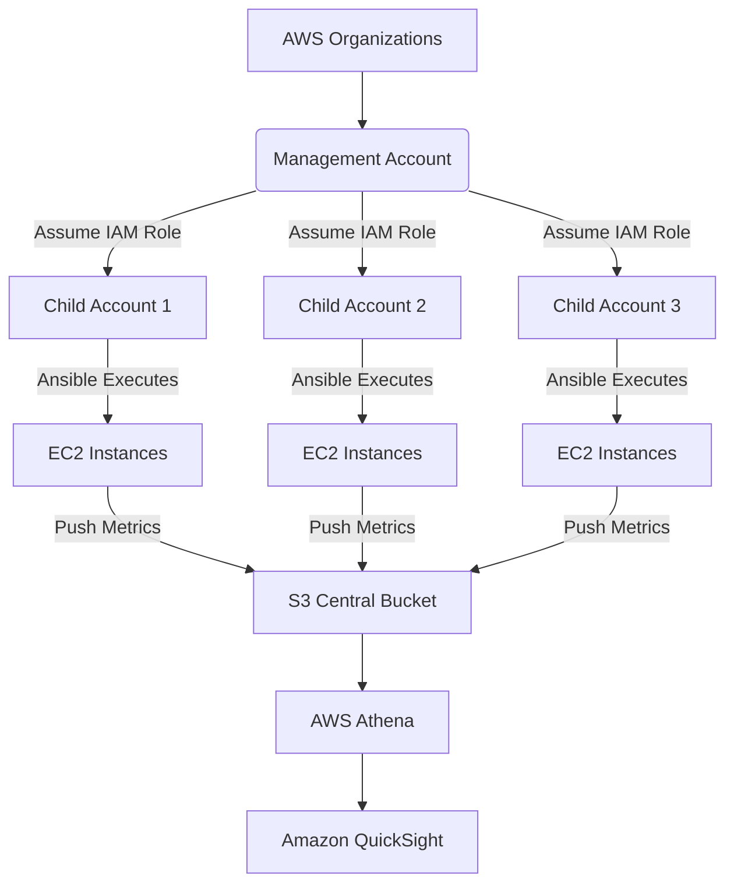
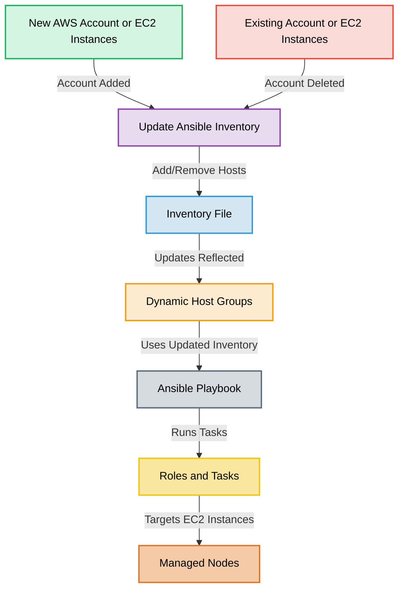
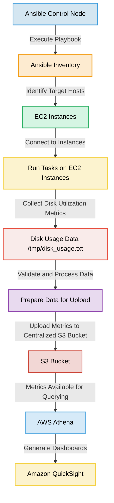
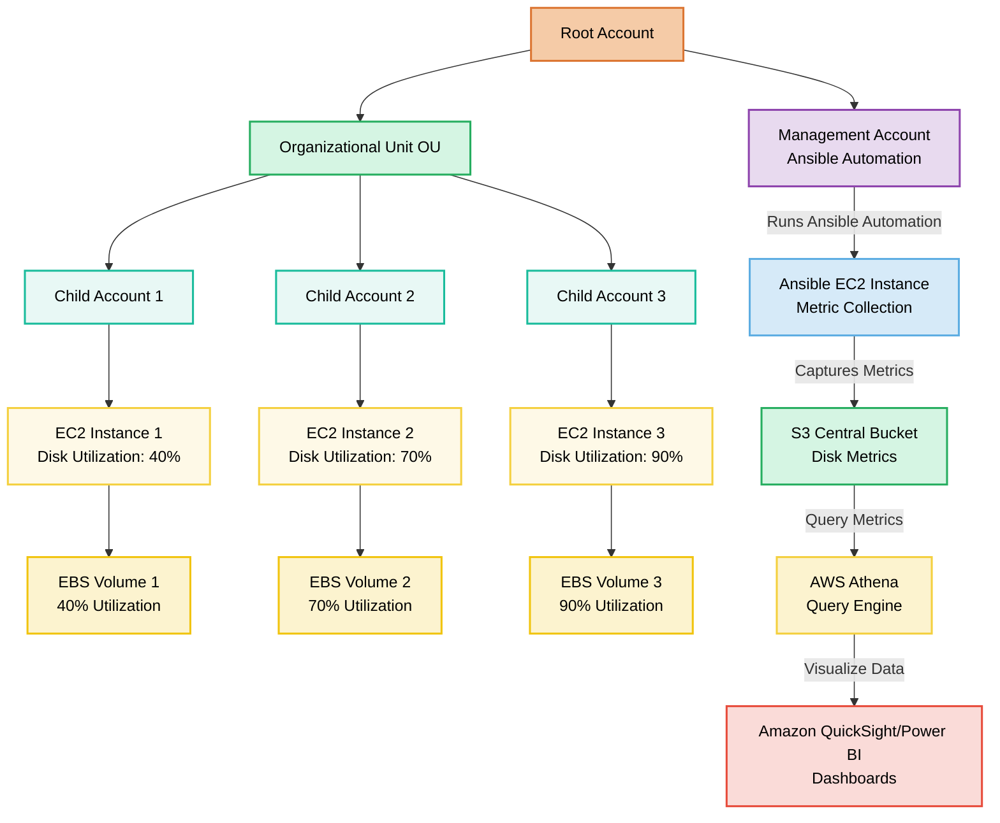
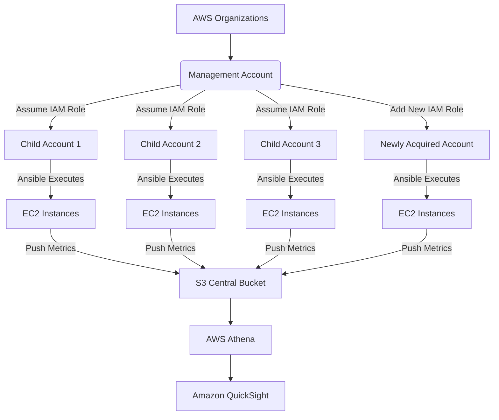

# ***Case study : Multi-Account AWS EC2 Disk Utilization Monitoring*** 

## Table of Contents
1. [Background and Problem Statement](#background-and-problem-statement)
2. [Proposed Solution Overview](#proposed-solution-overview)
3. [High-Level Architecture](#high-level-architecture)
4. [Technical Implementation](#technical-implementation)
5. [Scalability and Security](#scalability-and-security)
6. [Conclusion](#conclusion)

## Background and Problem Statement
This section describes the problem statement and the context for the solution.

```
Background:
You are a Solutions architect at a large enterprise that utilizes AWS cloud services. The company has grown through acquisitions and now manages 3 separate AWS accounts, each containing numerous EC2 instances. The CTO has expressed concerns about potential disk space issues across these instances and wants a comprehensive solution to monitor disk utilization.

Assignment:

Company is internally using a configuration management tool (Ansible). Before investing into other tools, the company has decided to use Ansible to perform the required metric collection.

Design and outline a solution to fetch and report disk utilization from all EC2 instances across the 3 AWS accounts. Your solution should address the following points:

1. How would you centralize access and management of the 3 AWS accounts?

2. How would you aggregate the collected data from all accounts into a single, easily digestible format?

3. How would your solution scale if the company acquires more companies and AWS accounts in the future?

						
Deliverables :

1. Provide a high-level architectural diagram of your proposed solution. 

2.  Provide the ansible playbook

3.  Summarize the various component involved in the process 

```


## Proposed Solution Overview
This section provides an overview of the proposed solution.

### Centralized Access and Management of Multi-Account AWS EC2 Disk Utilization Monitoring

This case study presents a scalable and cost-effective solution for monitoring EC2 disk utilization across multiple AWS accounts using AWS-native tools and Ansible automation. The architecture ensures centralized management, seamless scalability, and actionable insights through data visualization.


- Centralized multi-account management with AWS Organizations.
- Cross-account data collection using IAM roles and Ansible.
- Scalable architecture to accommodate new accounts seamlessly.
- Secure data storage and analysis using AWS S3, Athena, and QuickSight.

---
## High-Level Architecture
This section includes the architectural diagram and key components.

### ** High-Level Architectural Diagram**

The architecture centralizes access and management using **AWS Organizations** and **IAM Roles**. It ensures secure and scalable data aggregation from multiple AWS accounts.


#### Components of the Solution

1. **AWS Organizations:**  
     
   - Centralized multi-account management ensures seamless scalability.  
   - Allows the Management Account to assume roles in child accounts for metric collection.

   

2. **IAM Roles:**  
     
   - Cross-account access is enabled by creating IAM roles in child accounts with policies that permit EC2 instance interaction and S3 uploads.

   

3. **Ansible Playbook:**  
     
   - Automates the collection of disk utilization data and uploads it to a centralized S3 bucket.

   

4. **AWS S3:**  
     
   - Stores the raw data collected from EC2 instances in a structured format (e.g., by account and instance IDs).

   

5. **AWS Athena:**  
     
   - Allows querying of aggregated data directly from S3 using SQL-like syntax for easy analysis.

   

6. **Amazon QuickSight:**  
     
   - Visualizes disk utilization trends and generates insights from aggregated data.

   

7. **Security Considerations:**  
     
   - All S3 uploads use IAM roles to avoid hardcoding credentials.  
   - Data in S3 is encrypted using server-side encryption (SSE).
  
-----





#### Aggregating Data into a Single Format

To aggregate collected data into a single format:

1. **Data Upload to S3:**  
     
   - Organize data in a structured format in the S3 bucket:  
      ```bash 
     /account-id/instance-id/disk_usage.txt
      ```
     
2. **Data Query with Athena:**  
     
   - Create a table in Athena to read and query data from S3:  
   ```sql 
     CREATE EXTERNAL TABLE IF NOT EXISTS disk_utilization (  
       account_id STRING,  
       instance_id STRING,  
       disk_partition STRING,  
       total_space STRING,  
       used_space STRING,  
       available_space STRING,  
       utilization_percentage STRING  
     )  
     LOCATION 's3://central-metrics-bucket/metrics/';  
   ```
      
   - Run queries to aggregate data:  
       
   ```sql
     SELECT account_id, instance_id, utilization_percentage  
     FROM disk_utilization  
     WHERE utilization_percentage > 80;
   ```
     
3. **Visualization:**  
     
   - Connect Athena to QuickSight for trend analysis and custom dashboards.




#### **Additional Considerations**

1. **Security:**  
     
   - Ensure **IAM Role Policies** follow the least privilege principle.  
   - Avoid hardcoding credentials; use IAM roles and temporary credentials.

   

2. **Error Handling and Testing:**  
     
   - Test the Ansible playbook with a few EC2 instances before full deployment.  
   - Implement error handling and logging for all playbook steps.

   


---
## Technical Implementation
Details about the Ansible playbook, AWS configuration, and data aggregation. Here is step wise flow:

1. Ansible Control Node: Starts the playbook execution.
2. Ansible Inventory: Identifies the target EC2 instances from the inventory file.
3. EC2 Instances: Ansible connects to each EC2 instance and executes tasks.
4. Disk Utilization Metrics: Metrics are collected from EC2 instances and stored temporarily.
5. Validation: Validates the collected data and prepares it for upload.
6. S3 Bucket: Metrics are uploaded to a centralized S3 bucket.
7. AWS Athena: Data in the S3 bucket is queried for analysis.
8. Amazon QuickSight: Dashboards are generated for visualizing trends and metrics.



### ** Ansible Playbook**

#### **Playbook Overview**

Prerequisites:

Latest AWS CLI installed and configured with appropriate credentials.
Ansible installed with version 2.9.1 or above.
Sample Output:
After running the playbook, metrics will be uploaded to the specified S3 bucket. Example S3 folder structure:
```bash
s3://central-metrics-bucket/account-id/instance-id/disk_usage.txt
```


**Steps in the Playbook:**

1. **Install AWS CLI:** Ensures the managed nodes have the necessary tool to interact with AWS services.  
2. **Fetch Disk Utilization:** Runs the `df` command to capture disk metrics and stores the output in a temporary file.  
3. **Copy Locally:** Copies the metrics from the managed nodes to the control node for review.  
4. **Upload to S3:** Pushes the metrics to a centralized S3 bucket in the Management Account for aggregation.

#### **Playbook: `aws-disk-monitoring/disk_monitoring.yml`**

```yaml
---
- name: Multi-Account EC2 Disk Monitoring
  hosts: all
  gather_facts: false
  tasks:
    - name: Install AWS CLI
      yum:
        name: aws-cli
        state: present

    - name: Collect Disk Utilization
      shell: |
        df -h | grep '^/dev/' > /tmp/disk_usage.txt
      register: disk_utilization_output

    - name: Validate Disk Utilization File
      stat:
        path: /tmp/disk_usage.txt
      register: disk_file

    - name: Upload Metrics to Central S3
      aws_s3:
        bucket: central-metrics-bucket
        object: "metrics/{{ inventory_hostname }}_disk_usage.txt"
        src: /tmp/disk_usage.txt
        mode: put
        region: us-east-1
      when: disk_file.stat.exists
```

#### **How to Use the Playbook**
1. Define hosts in an inventory file (`inventory.yml`).
2. Run the playbook:
   ```bash
   ansible-playbook -i inventory.yml disk_monitoring.yml
   ```

---

### **3. Centralized Access and Management**


#### **Using AWS Organizations**
1. **Centralized Management with AWS Organizations:**
   - Link all AWS accounts to a single **Management Account**.
   - Enable consolidated billing and governance for all accounts.

2. **IAM Roles for Cross-Account Access:**
   - Create **IAM Roles** in each Child Account that the Management Account can assume.
   - Roles include permissions for EC2 instance access and S3 uploads.

  




3. **Example IAM Role Policy (Child Account):**
   ```json
   {
     "Version": "2012-10-17",
     "Statement": [
       {
         "Effect": "Allow",
         "Principal": {
           "AWS": "arn:aws:iam::MANAGEMENT_ACCOUNT_ID:root"
         },
         "Action": "sts:AssumeRole"
       },
       {
         "Effect": "Allow",
         "Action": [
           "ec2:DescribeInstances",
           "ec2:DescribeVolumes",
           "s3:PutObject",
           "s3:GetObject"
         ],
         "Resource": "*"
       }
     ]
   }
   ```

5. **Security Best Practices:**
   - Enforce MFA for role assumption.
   - Enable CloudTrail and AWS Config for monitoring access and compliance.

---

### ** Aggregating Data into a Single Format**

#### **Centralized Data Aggregation**
1. Collected metrics are uploaded to a centralized **S3 Bucket** in the Management Account.
   - Data is organized using prefixes:
     ```bash
     /child-account-id/instance-id/disk_usage.txt
     ```

2. Use **AWS Athena** to query data from S3:
   - Example Athena table:
     ```sql
     CREATE EXTERNAL TABLE disk_utilization (
       account_id STRING,
       instance_id STRING,
       disk_partition STRING,
       total_space STRING,
       used_space STRING,
       available_space STRING,
       utilization_percentage STRING
     )
     LOCATION 's3://central-metrics-bucket/metrics/';
     ```
   - Query disk space usage exceeding 80%:
     ```sql
     SELECT account_id, instance_id, utilization_percentage
     FROM disk_utilization
     WHERE utilization_percentage > 80;
     ```

#### **Visualization with Amazon QuickSight**
1. Connect QuickSight to Athena for dashboard creation.
2. Build visualizations to monitor disk utilization trends across accounts.

---

## Scalability and Security
Discusses how the solution scales and ensures data security.

### **3\. Scalability Summary**

#### **Scaling Approach**

1. **AWS Organizations:**

   * Add newly acquired accounts to **AWS Organizations** for centralized governance.  
   * Enable consolidated billing and access control through Service Control Policies (SCPs).  
2. **IAM Roles:**

   * For each new account, create an **IAM Role** to allow cross-account access.  
   * Assign the Management Account permissions to assume these roles.





Example IAM Role Policy:
```json
 {  
  "Version": "2012-10-17",  
  "Statement": [  
    {  
      "Effect": "Allow",  
      "Principal": {  
        "AWS": "arn:aws:iam::MANAGEMENT_ACCOUNT_ID:root"  
      },  
      "Action": "sts:AssumeRole"  
    },  
    {  
      "Effect": "Allow",  
      "Action": [  
        "ec2:DescribeInstances",  
        "ec2:DescribeVolumes",  
        "s3:PutObject"  
      ],  
      "Resource": "*"  
    }  
  ]  
}
```  
3. **Ansible Inventory:**

   * Dynamically update the **inventory.yml** file to include new accounts and EC2 instances.

Example inventory file:  
```ansible
 all:  
  children:  
    account_1:  
      hosts:  
        ec2-1: { ansible_host: 192.168.1.10, ansible_user: ec2-user }  
        ec2-2: { ansible_host: 192.168.1.11, ansible_user: ec2-user }  
    account_2:  
      hosts:  
        ec2-3: { ansible_host: 192.168.2.10, ansible_user: ec2-user }
```
4. **S3 Bucket Structure:**

Organize metrics by account and instance in the **S3 central bucket**:  
 ```
/account-id/instance-id/disk_usage.txt
```
 
5. **Athena for Querying:**

   * Athena queries automatically adapt as new data is uploaded.

Example query:  
```sql
 SELECT account_id, instance_id, utilization_percentage  
FROM disk_utilization  
WHERE utilization_percentage > 80;
```
   
6. **Visualization with QuickSight:**

   * Dashboards dynamically display data as new accounts and metrics are added.


### **Scalability Example**

#### **Adding a New Account**

1. Add the new account to **AWS Organizations**.  
2. Configure an IAM Role in the new account with the necessary permissions.  
3. Update the Ansible inventory with the new account’s EC2 instances.

Run the playbook:  
```
 ansible-playbook -i inventory.yml disk_utilization_monitoring.yml
```


Scaling Example:
If the organization acquires a new account, you simply:

a. Add the account to AWS Organizations.
b. Configure a new IAM role for the Management Account.
c. Update the Ansible inventory file.
d. The rest of the workflow remains automated.

Simplify IAM Role Policy

```json
{
  "Version": "2012-10-17",
  "Statement": [
    {
      "Effect": "Allow",
      "Action": [
        "ec2:DescribeInstances",
        "s3:PutObject"
      ],
      "Resource": "*"
    }
  ]
}
```

#### **Data Aggregation and Reporting**

* Metrics from the new account are automatically uploaded to the S3 bucket.  
* Athena queries dynamically include new data for reporting.  
* Dashboards in QuickSight automatically refresh with updated data.

## Conclusion
This solution offers a robust framework for centralized disk utilization monitoring across multiple AWS accounts. By leveraging Ansible and AWS-native tools, it minimizes costs, ensures scalability, and provides actionable insights through data visualization.

### **5. Summary of Components**

1. **AWS Organizations:**
   - Links all accounts for centralized governance and billing.

2. **IAM Roles:**
   - Enables secure, cross-account access from the Management Account.

3. **Ansible Playbook:**
   - Automates metric collection and centralization.

4. **AWS S3:**
   - Acts as the central data repository.

5. **AWS Athena:**
   - Provides querying capability for aggregated metrics.

6. **Amazon QuickSight:**
   - Offers dashboards for monitoring disk utilization trends.

7. **Security:**
   - Enforce IAM role least privilege.
   - Ensure S3 encryption and access logging.


